<div align="center">

<a href="https://www.linkedin.com/in/dev-mondal-497986223/"></a>
<a href="https://inquilv1.vercel.app"></a>
<a href="https://github.com/DevxD98?tab=repositories"></a>


</div>


## ◈ manifest

```yaml
agent     : dev mondal
callsign  : DevxD98
based     : vadodara, india
role      : full-stack engineer · builds agents and the tools they run on
shipping  : inquil — an ai co-writer for people writing actual books
studying  : transformers from first principles, evals, retrieval
believes  : a demo is not a product; ship the boring parts too
open_to   : collaborations, freelance, anything with real users
```


## ◈ now in flight

> [!NOTE]
> **[InQuil](https://github.com/DevxD98/inquil-web-prod)** — a writing workspace that treats a manuscript like a manuscript, not a text box.
> Real paper geometry, CSS multi-column pagination across book spreads, page furniture edited in place, and a docked
> **Co-writer** surface that suggests without hijacking the page. Recent work: batching suggestion scans so the editor
> never stalls, cutting the toolbar from nineteen controls down to seven, and collaborator discovery.
> → **[inquilv1.vercel.app](https://inquilv1.vercel.app)**


## ◈ selected deliveries

| | project | what it is |
|---|---|---|
| ✦ | **[InQuil](https://github.com/DevxD98/inquil-web-prod)** | AI co-writer + paginated manuscript editor. Spreads, furniture, threads, live collaborators. |
| ✦ | **[JimmyLabs](https://github.com/DevxD98/JimmyLabs)** | A GPT-style language model built from scratch — and fully documented — on a MacBook Air M1 with 8GB. Documentation-first, so the *why* survives. |
| ✦ | **[SnackOps](https://github.com/DevxD98/SnackOps)** | An agent that turns fridge photos, receipts and ingredient lists into real meal plans. Multi-modal perception → nutrition tools → planning. |
| ✦ | **[auto-tester](https://github.com/DevxD98/auto-tester)** | Evidence-driven web testing. Heuristic generation first, AI only where it earns its place. Watch a run execute live, get a report with coverage. |
| ✦ | **[MCP Form Tester](https://github.com/DevxD98/MCP-FORM_TESTER-AGENT)** | An MCP agent that drives and validates web forms — tooling for the agentic web itself. |
| ✦ | **[Blobtracking](https://github.com/DevxD98/Blobtracking)** | Real-time blob tracking in TouchDesigner. Generative, interactive, and the most-starred thing I've published. |
| ✦ | **[kept](https://github.com/DevxD98/kept)** | A habit tracker that looks like an A5 grid journal on a wooden desk. Every dimension snaps to a 5mm grid. |
| ✦ | **[transcly](https://github.com/DevxD98/transcly)** | Transcription pipeline with a browser extension and a web client alongside it. |


## ◈ toolkit

<div align="center">

**surface**


**engine**


**bench**


</div>


## ◈ signals

<div align="center">


&nbsp;


<br/><br/>


<br/><br/>


</div>


## ◈ the courier's route

<div align="center">

<picture>
  <source media="(prefers-color-scheme: dark)" srcset="https://raw.githubusercontent.com/DevxD98/DevxD98/output/github-contribution-grid-snake-dark.svg" />
  <source media="(prefers-color-scheme: light)" srcset="https://raw.githubusercontent.com/DevxD98/DevxD98/output/github-contribution-grid-snake.svg" />
  
</picture>

</div>


<div align="center">

**building quietly in Vadodara — if something here is useful to you, say hello.**

<a href="https://www.linkedin.com/in/dev-mondal-497986223/"></a>

</div>


