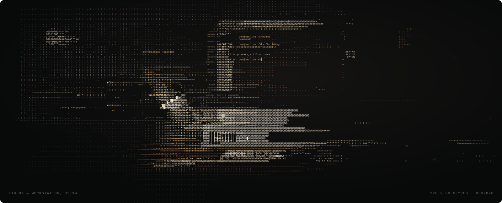
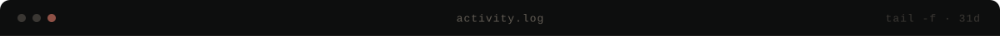

<p align="center">
  
</p>

<br />

### Dev Mondal

<sub>full-stack developer &nbsp;·&nbsp; product builder &nbsp;·&nbsp; open-source contributor</sub>

I build useful software, weird interfaces, developer tools, and experiments.

<br />

#### `/about`

I work across the whole stack — from the interface someone clicks on to the systems quietly running underneath it.
Most of what I make starts as a small annoyance and a *“what if…?”*

```text
interests
  ├── ai-native developer tools
  ├── full-stack products
  ├── native / performance-first software
  ├── automation & agents
  ├── open source
  └── design engineering
```

<br />

#### `/currently-building`

- **[kept.website](https://kept.website)** — simple notes on the web
- **[SessionSense](https://github.com/DevxD98/sessionsense-releases)** — a small desktop utility
- **Inquil** — tools for writers
- **open source** — fixes and features across projects I use

<br />

#### `/stack`

```text
TypeScript · Next.js · React
Node.js · Python
AWS · Vercel · Firebase
Git · GitHub
```

<br />

#### `/signal`

<p>
  <br />
  
</p>

<br />

[GitHub](https://github.com/DevxD98) &nbsp;/&nbsp; [X](https://x.com/whooissdev) &nbsp;/&nbsp; [LinkedIn](https://www.linkedin.com/in/dev-mondal-497986223/)

<br />

<picture>
  <source media="(prefers-color-scheme: dark)" srcset="https://raw.githubusercontent.com/DevxD98/DevxD98/output/retro-snake-dark.svg" />
  
</picture>

```text
$ status
still building_
```
